# Навигация
1. [Главная](#мод-для-майнкрафта)  
  1.1 [Описание](#описание)  
  1.2 [Требования](#требования)  
  1.3 [Как в это играть?](#как-в-это-играть)
2. [Техническая часть](#техническая часть)  
  2.1 [Подготовка](#подготовка)  
  2.2 [Предисловие](#предисловие)  
  2.3 [Создание нового типа мира](#создание-нового-типа-мира)  
  2.4 [Шум и его настройки](#шум-и-его-настройки)

# Мод для Майнкрафта

## Описание
Мод, добавляющий в Майнкрафт новый тип мира - МИР-Н. В мире МИР-Н полностью изменена генерация ландшафта. МИР-Н состоит из гигантских вертикальных, изрезанных пещерами островов.
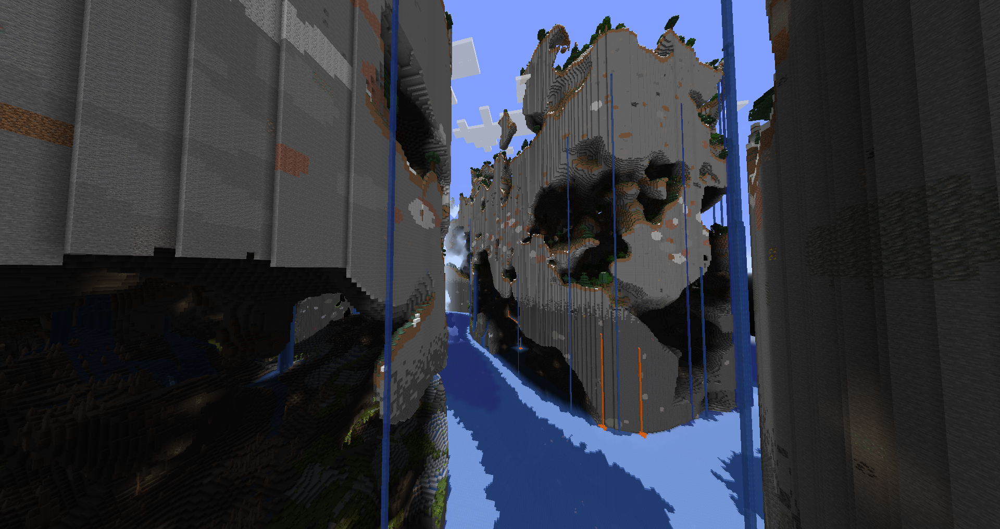


### Функционал
- **Переработанный ландшафт** и новое распределение биомов, сохраняющие функционал основной игры (все биомы, структуры, блоки и ресурсы из обычной игры могут натурально сгенерироваться в мире)
  - Многоуровневая генерация растительности всех биомов (раньше растения могли появляться процедурным путем только на поверхности)
  - Увеличена высота верхнего мира (раньше: от -64 до 320, теперь: от -256 до 256)
- Палки теперь работают как зубочистки
- Локализован на русском и английском языках

## Требования
- Майнкрафт Java Edition версии 1.20.1
- [Загрузчик модов Forge](https://files.minecraftforge.net/net/minecraftforge/forge/index_1.20.1.html "Forge") для версии 1.20.1

## Как в это играть?
1. Убедитесь, что все [требования]((#требования) выполнены;
2. Скачать из этого репозитория архив мода последней версии;
3. Установить мод ([как устанавливать моды](https://apexminecrafthosting.com/how-to-install-mods-on-forge/));
4. Перейти в меню "Создать новый мир". Во вкладке "Мир" пролистать опцию "Тип мира" до "МИР-Н", выставить остальные настройки по своему желанию и нажать "Создать новый мир".  
4.1 Если появляется предупреждение о том, что мир использует экспериментальные настройки - нажать "Да";  
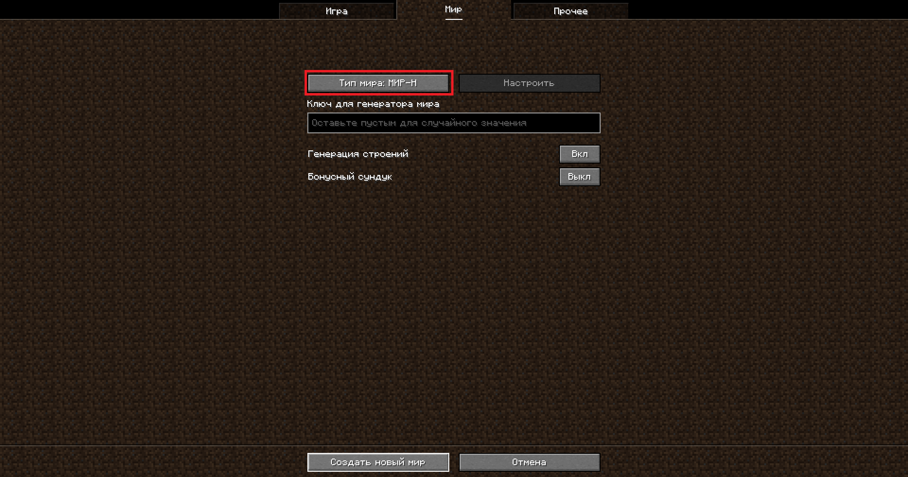
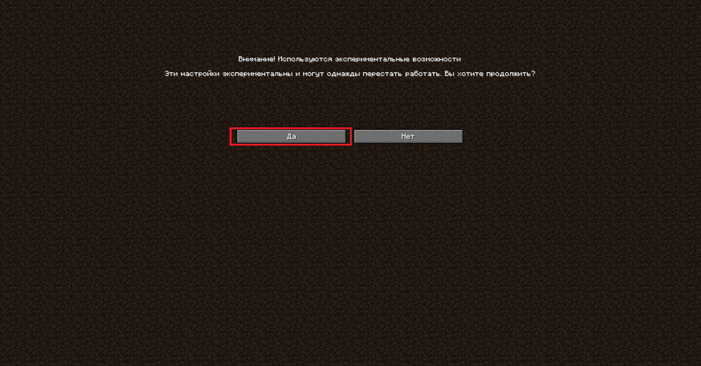
5. Играйте, как в обычный Майнкрафт и исследуйте безумную новую генерацию.

# Техническая часть

## Подготовка
- Gradle - система сборки, идет в комплекте с Forge.
- [Parchment Mappings](https://parchmentmc.org) - маппинги для функций и полей классов. Исходный код игры подвержен обфускации. ParchmentMC помогает привязать к запутанным именам более понятные и читаемые.
- [Forge Mixins](https://github.com/SpongePowered/Mixin/wiki/Mixins-on-Minecraft-Forge) - миксины. Миксины позволяют вклиниться в методы, описанные в исходном коде игры. 
- [Access Transformers](https://docs.minecraftforge.net/en/1.20.1/advanced/accesstransformers/) - трансформаторы доступа. Позволяют изменять видимость и некоторые другие параметры полей исходного кода игры.
- [HotswapAgent](https://github.com/HotswapProjects/HotswapAgent) - модификация для JDK, которая позволяет производить хотсвап (горячую замену) во время выполнения программы. Нужен для экономии времени при разработке (не перезапускать игру каждый раз). Позволяет менять все, кроме супер-классов. Так же не работает на миксины.
- [JetBrainsRuntime 17](https://github.com/JetBrains/JetBrainsRuntime/releases) - модифицированный вариант JRE, со встроенной поддержкой функционала HotswapAgent'а.
- [Linkie](https://linkie.shedaniel.dev/mappings) - сайт, который помогает написать полное название полей/методов в правильном формате, чтобы использовать в миксинах или трансформаторах доступа.

## Предисловие
  Разобраться в том, как работает генерация мира Майнкрафт мне оказалось довольно нелегко по нескольким причинам:
- Отсутствие хороших гайдов и подробных объяснений в открытом доступе. Из наиболее полезного могу лишь порекомендовать два видеоматериала от разработчика, который непосредственно занимался созданием текущей системы генерации в игре: [[1]](src/generated/resources/data) [[2]](https://www.youtube.com/watch?v=ob3VwY4JyzE). Но даже там изложены лишь основы, не говоря уже о том, что все примеры представлены довольно абстрактно (в псевдо-коде), без объяснения реализаций;
- Переписывание игры с каждой новой версией. Каждый год разработчики выпускают новую версию, и как оказалось, даже минорные релизы (например переход от 1.20.5 к 1.20.6) могут существенно изменить архитектуру, делая всю существующую документацию к старым версиям неактуальной. Особенно сильный удар пришел в 2021 году с выходом версии 1.18 - в ней принципы генерации миров и способы описания этих принципов изменились до неузнаваемости;
- Не самый простой к прочтению и пониманию код игры;
- Математика... Еще и в json формате...

Для меня единственным способом разобраться, как что работает - стало бесконечное чтение исходного кода игры (который разумеется не задокументирован даже на четверть, а еще и некоторые места в нем так и не были замапенны в ParchmentMC) и тыкаться часами в попытках понять, какая настройка за что отвечает. Многое, даже то, что было задокументировано на википедии, для меня было совершенно нетривиальным и у меня ушли десятки часов на понимание темы.

Львиная доля описаний правил генерации мира передается игре путем дата-паков (наборы .json файлов). Все файлы, описывающие правила и алгоритмы генерации мира находятся в [src/generated/resources/data](src/generated/resources/data). Папки [fogy](src/generated/resources/data/fogy) и [minecraft](src/generated/resources/data/minecraft) представляют собой именные пространства (namepsace).

## Создание нового типа мира
Хороший мод должен быть совместимым с другими. Чтобы достичь совместимости необходимо не изменять существующие типы миров, а создать новый. Новый тип мира создается путем добавления [normal.json](src/generated/resources/data/minecraft/tags/worldgen/world_preset/normal.json). Наличие этого файла подскажет майнкрафту, что нужно загрузить ресурсы генерации мира, находящиеся в именном пространстве fogy.

Описание типа мира хранится в [fogy_world_preset.json](src/generated/resources/data/fogy/worldgen/world_preset/fogy_world_preset.json).
В нем интересующие нас строчки:
```json
  "minecraft:overworld": {
      "type": "fogy:fogy_overworld",
      "generator": {
        "type": "minecraft:noise",
        "biome_source": {
          "type": "minecraft:multi_noise",
          "preset": "minecraft:overworld"
        },
        "settings": "fogy:fogy_noise_settings"
      }
    }
```
а именно:  
`"type": "fogy:fogy_overworld"` - указывает, что тип измерения определен в [fogy_overworld.json](src/generated/resources/data/fogy/dimension_type/fogy_overworld.json);  
` "settings": "fogy:fogy_noise_settings"` - указывать, что настройки шума определны в [fogy_noise_settings.json](src/generated/resources/data/fogy/worldgen/noise_settings/fogy_noise_settings.json);

### Тип измерения
По большей части остался без изменений, за исключением трех строк:  
`"logical_height": 512` - "логическая высота", используется для вычисления места, куда порталы могут перенести игрока в рамках этого измерения, например, в аду логическая высота меньше, чем высота строительства - поэтому порталы над потолком ада строить можно, но ни один портал не переместит игрока в пространство над потолком;  
`"min_y": -256` - координата y дна измерения;  
`"height": 512` - максимальная высота, считая от дна мира, где можно ставить блоки;  

## Шум и его настройки
Шум - пожалуй, самая важная концепция в этой теме. Вся генерация Майнкрафта завязана на шуме, а именно на трехмерном шуме Перлина. Все использованные мной шумы расположены в [noise](src/generated/resources/data/fogy/worldgen/noise). У шума Перлина есть такие настройки, как амплитуды (параметр amplitudes) и октавы (задается с помощью первой октавы - firstOctave). Не вдаваясь глубоко в вычисления:  
- Больше амплитуд = больше шумовых пятен
- Больше значение амплитуды = более зернистый шум
- Больше значение первой октавы = более мелкие шумовые пятна
Шум Перлина в Майнкрафте именно трехмерный (это следует понять, потому что большая часть инструментов, визуализирующих шум Перлина, представляют его в виде двумерной карты - поэтому такой шум на картинке и в игре будет сильно отличаться!).

Смысл всех настроек в [fogy_noise_settings.json](src/generated/resources/data/fogy/worldgen/noise_settings/fogy_noise_settings.json) понятен из их названия, за исключением двух: `noise_router` и `surface_rule`.

### Noise Router
`noise_router` состоит из набора функций плотности. Функции плотности могут быть описаны как внутри [fogy_noise_settings.json](src/generated/resources/data/fogy/worldgen/noise_settings/fogy_noise_settings.json), так и в файлах внутри [density_function](src/generated/resources/data/fogy/worldgen/density_function). Функция плотности - это функция, которая по результату некоторых математических операций (обычно над шумом или градиентом) возвращает одно значение (обычно число с плавающей запятой от -1 до 1). Каждый ключ в `noise_router` отвечает за поределенную настройку генерации ландшафта.
#### Final Density
Главная функция плотности. Рассчитывается для каждого набора координат (x, y, z) в мире.  
Если для набора координат это функция возвращает положительное значение - на этих координатах будет стоять `default_block`, если же неположительное - блок воздуха (`minecraft:air`). Поскольку это ключевая функция в создании ландшафта, то разберу её подробно:

```
"final_density": {
      "type": "minecraft:add", (5)
      "argument1": {
        "type": "minecraft:range_choice", (4)
        "input": {
          "type": "minecraft:add", (3)
          "argument1": "fogy:overworld/terrain/island_stem" (2),
          "argument2": "fogy:overworld/terrain/island_cheese" (1)
        },
        "min_inclusive": 2,
        "max_exclusive": 2.001,
        "when_in_range": 1,
        "when_out_of_range": 0
      },
      "argument2": "fogy:overworld/terrain/floor"
    }
```
1. [island_cheese](src/generated/resources/data/fogy/worldgen/density_function/terrain/island_cheese.json) - функция плотности, которая генерирует вырезанные пещеры. Выглядит следующим образом:
```
{
	"type": "minecraft:range_choice", (3)
	"input": {
		"type": "minecraft:clamp", (2)
		"input": {
			"type": "minecraft:noise", (1)
			"noise": "fogy:island_cheese",
			"xz_scale": 2,
			"y_scale": 2
		},
		"min": -1,
		"max": 1
	},
	"min_inclusive": 0,
	"max_exclusive": 1.001,
	"when_in_range": 1,
	"when_out_of_range": 0
}
```
1.1 Берется шум (зернистости и плотности, которой я выбрал), растягивается горизонтально и вертикально в два раза (чтобы увеличить объем пещер).  
1.2 В каждой своей точке этот шум принимает какие-то значения. Чтобы получить значения, с которыми удобно работать - шум нормализуется. Все его значения от меньшего к большему линейно сопоставляются значениям от -1 до 1.  
1.3 Если значение шума в точке от 0 до 1, то назначить значение в этой точке - 1, в противном случае - 0. 

То есть эта функция плотности производит шум, который наполняет весь мир случайными пещерами.

2. [island_stem](src/generated/resources/data/fogy/worldgen/density_function/terrain/island_stem.json) - функция плотности, которая генерирует высокие столбы в форме пятен. Выглядит следующим образом:
```
{
  "type": "minecraft:range_choice",
  "input": {
    "type": "minecraft:add",
    "argument1": {
      "type": "minecraft:clamp", (2)
      "input": {
        "type": "minecraft:noise", (1)
        "noise": "fogy:islands",
        "xz_scale": 1,
        "y_scale": 0
      },
      "min": -1,
      "max": 1
    },
    "argument2": "fogy:overworld/terrain/ceiling" (3)
  },
  "min_inclusive": 0.001,
  "max_exclusive": 1.001,
  "when_in_range": 1,
  "when_out_of_range": 0
}
```
2.1 Берется шум (зернистости и плотности, которой я выбрал) и к нему применяется интересный трюк: в горизонтальной плоскости шум растягивается в 1 раз (то есть не изменяется), а в вертикальной - в 0 раз. Это значит, что значение шума в игре для любой координаты y будет равным y*0, то есть 0, а значит, что для любых блоков с координатами (x, z) значение шума будет одинаковым от дна до полотка мира (равное значению, полученному на нулевом уровне мира). Получается двумерный шум.  
2.2 Шум нормализуется.  
2.3 К шуму прибавляется значение функции плотности [ceiling](src/generated/resources/data/fogy/worldgen/density_function/terrain/ceiling.json):  
```
{
  "type": "minecraft:range_choice", (4)
  "input": {
    "type": "minecraft:add", (3)
    "argument1": {
      "type": "minecraft:y_clamped_gradient", (1)
      "from_y": -256,
      "to_y": 256,
      "from_value": 10,
      "to_value": -0.25
    },
    "argument2": {
      "type": "minecraft:noise", (2)
      "noise": "minecraft:gravel",
      "xz_scale": 2,
      "y_scale": 0
    }
  },
  "min_inclusive": -10000,
  "max_exclusive": 1,
  "when_in_range": -1,
  "when_out_of_range": 0
}
```
2.3.1 Берется градиент от дна до потолка мира, где каждому набору координат (x, y, z) присваивается значение от 10 до -0.25. То есть чем выше блок, тем ниже его значение.  
2.3.2 Берется двумерный шум.
2.3.3 Градиент и шум складываются, и получается, случайный узор:
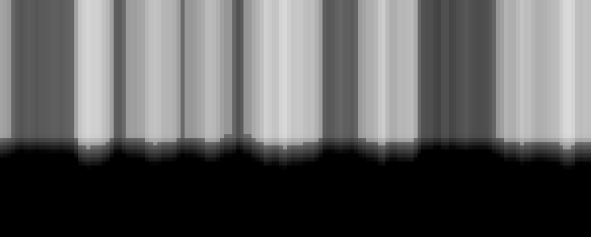  
Чем темнее значение - тем оно выше. Белые значения - отрицательные.  
2.3.4 Если значение меньше 1, то вернуть -1, в противном случае - 0.  
  
Белые пиксели соответствуют значению -1, а серые 0.  
Поскольку значения island_stem нормализованы от -1 до 1, сложение с этой функцией приведет к тому, что белые пиксели "занулят" верхушку мира. 
2.4 Если значение шума в точке от 0 до 1, то назначить значение в этой точке - 1, в противном случае - 0.   
3. Для каждого блока в мире значения функций плотности island_stem и island_cheese складываются.  
4. Логика простая: мы знаем, что island_stem и island_cheese возвращают либо 0, либо 1. То есть их сумма может быть 0, 1 или 2. Если для блока сумма этих двух функций 0 - значит, ни одна функция не посчитала нужным поставить этот блок, если 1 - только одна из функций установила этот блок в твердое состояние, а если 2 - обе функции поставили на этих координатах твердый блок (Да, логику можно было существенно упростить, использовав умножение, но об этом я догадался только сейчас). То есть, чтобы получить одновременно и острова, и пещеры - надо все блоки, для которых функция плотности не равна 2 занулить.  
5. Прибавить функцию плотности, которая отвечает за генерацию дна мира.

Генерация одного и того же мира для разных этапов:
1. Только пещеры
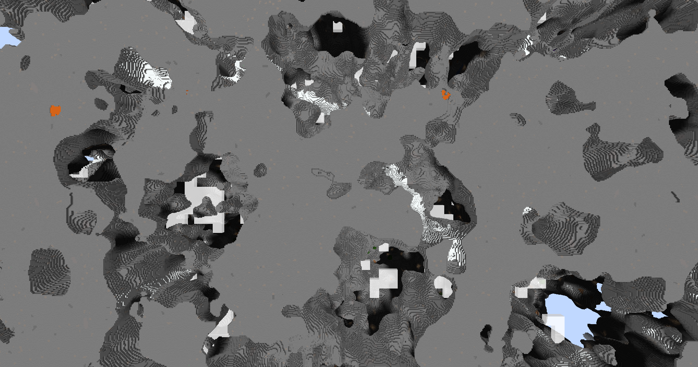
2. Только острова
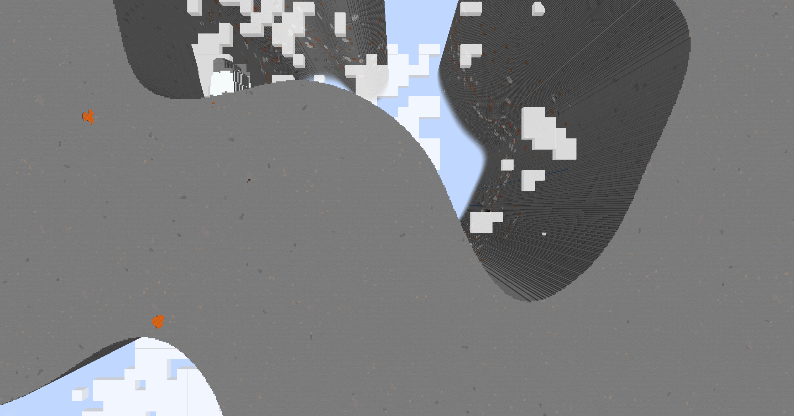
3. Только острова, но уже с вырезанным потолком
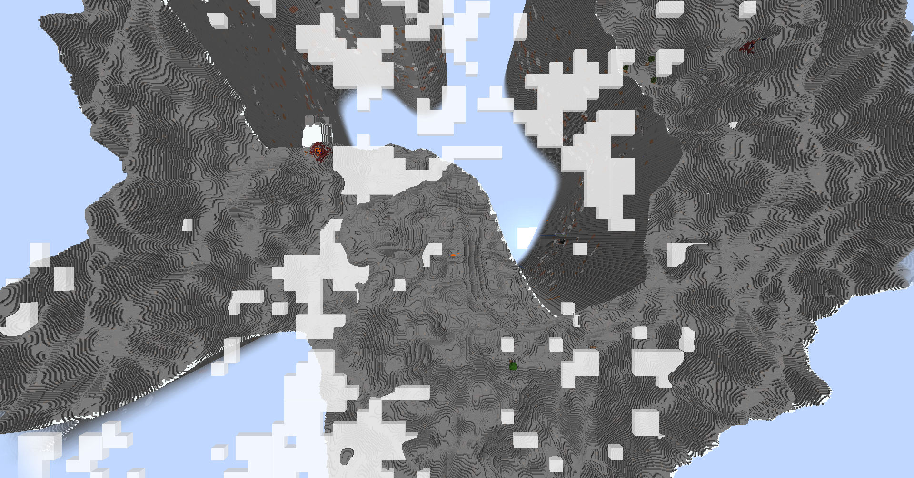
4. Готовые острова с пещерами
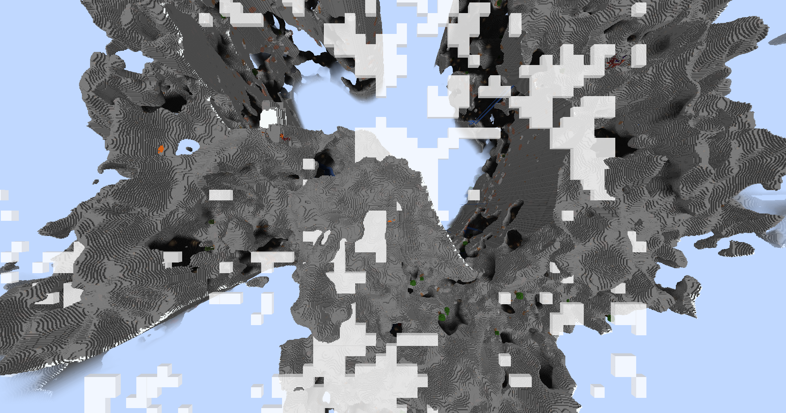

#### Initial density without jaggedness
Функция необходима далее для вычисления [Surface Rule](#surface-rule). Она должна возвращать положительное число, для той координаты y, которая должна быть начальной высотой мира, грубо говоря - уровень, выше которого горы, а ниже пещеры. Затем значения этой функции интерполируются, чтобы придать гладкость хаотичной функции.

#### Генерация биомов
В генерации биомов участвуют несколько параметров:
- Температура 
- Растительность/Влажность 
- Континентальность - насколько биом удален от берега
- Эрозия 
- Глубина
- Странность - из нее высчитываются варианты биомов. Так например, если странность высокая, то джунгли будут изменены на бабмуковые джунгли.

Каждый из этих параметров выбирается с помощью какой-либо функции плотности и накладывается на блок. Если блок удовлетворяет всем параметрам биома, то этот биом появится на этом блоке.  
Есть совсем непритязательные биомы, у которых требований либо нет совсем, либо очень мало: например реки и пустыни могут появляться где угодно, если температура позволяет. Тогда как, зубчатые пики или замороженные пики требуют определенного уровня странности, глубину, эрозию и температуру.

Моей задачей было сделать так, чтобы все биомы имели шанс появиться в моейм ландшафте, и появиться в правильном месте. 

##### Континентальность
Континентальность показывает насколько биом удален от берега, соответственно надо сделать так, чтобы биом океан был ТОЛЬКО между островами, а биомы, которые должны быть на острове, не "проливались" за его пределы. Я долго думал, а потом как понял: можно использовать тот же самый [двумерный шум](src/generated/resources/data/fogy/worldgen/density_function/overworld/continents.json), что и для генерации островов! В Майнкрафте из одного и того же сида (сид - ключ генерации мира) получится всегда одна и та же шумовая карта, а значит, что можно использовать в одном мире один и тот же шум дважды, и они обязательно сойдутся. 

##### Температура
С [температурой](src/generated/resources/data/fogy/worldgen/density_function/overworld/temperature.json) все было легко: это просто случайный двумерный шум. Двумерный он потому, что я не хотел, чтобы на одном острове могла появиться джунгли и снежная равнина - это бы смотрелось странно, как по мне.

##### Влажность
Аналогичная ситуация с [температурой](#температура): [влажность](src/generated/resources/data/fogy/worldgen/density_function/overworld/vegetation.json)

##### Глубина
Вот глубина заставила меня попотеть. Изначально для вычисления глубины, я просто использовал стандартный градиент (чем ниже координата y - тем больше глубина), но недостатки такого подхода стали быстро очевидны. Пещерные биомы, например карстовые или пышные пещеры, генерируются, как раз опираясь на глубину. Посколько простой градиент считает для всех координат (x, z) на одинаковой высоте y одинаковое значение глубины, то получается, что, например, на уровне -20 над океаном и на уровне -20 в пещерах острова будут одинаковые значения глубины. Если значения глубины над океаном такое же, как внутри острова, то игра генерирует пещерные биомы прямо в воздухе над водой - что абсолютно неприемлимо.

После долгих размышлений до меня дошло, что можно связать глубину и континентальность. Так как отрицательная континентальность показывает сильное удаление от берега в сторону воды (то есть океан), можно [складывать континентальность и градиент](src/generated/resources/data/fogy/worldgen/density_function/overworld/depth.json). В таком случае к градиенту над островами будет прибавляться 0, а к градиенту над океаном -1 - делая глубину неподходящей для генерации пещерных биомов. 

##### Эрозия
С [эрозией](src/generated/resources/data/fogy/worldgen/density_function/overworld/erosion.json) ситуация аналогичная с [глубиной](#глубина). Посколько эрозия не должна влиять на генерацию биомов над океанами, то над океанами (там где отрицательная континентальность) к ней прибавляется -1. Только по сравнению с глубиной, эрозия - величина хаотичная, поэтому она прибавляется не к градиенту, а к шумовым значениям.

##### Странность
Трудность была в том, что [странность](src/generated/resources/data/fogy/worldgen/density_function/overworld/ridges.json) не применяется в генерации напрямую, а лишь участвует в формуле для вычисления странности ландшафта. Удалось побороть эту задачу тем, что я рассчитываю в этой функции плотность так, что отрицательные и положительные значения равные по модулю дадут одну и ту же странность ландшафта, но дадут противоположные показатели странности.


#### Проблема с лавой
Увеличив высоту мира и изменив глубину океанов, я столкнулся с проблемой: по какой-то причине все нетвердые блоки, в том числе вода и воздух, ниже -54 уровня в мире заменялись на лаву:

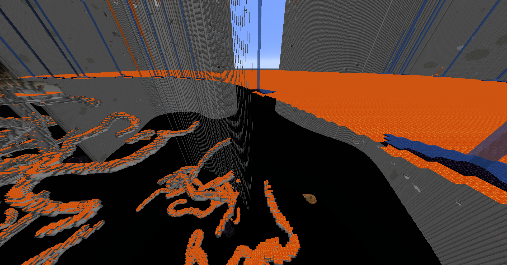  
Пару лет назад кто-то даже [зарепортил](https://bugs.mojang.com/browse/MC-237017) это как баг разработчикам, но ответа от них пока не поступило.  
Пришлось брать все в свои руки и спустя пару часов поисков в коде, я установил первопричину:
```
private static Aquifer.FluidPicker createFluidPicker(NoiseGeneratorSettings pSettings) {
      Aquifer.FluidStatus aquifer$fluidstatus = new Aquifer.FluidStatus(-54, Blocks.LAVA.defaultBlockState());
      int i = pSettings.seaLevel();
      Aquifer.FluidStatus aquifer$fluidstatus1 = new Aquifer.FluidStatus(i, pSettings.defaultFluid());
      Aquifer.FluidStatus aquifer$fluidstatus2 = new Aquifer.FluidStatus(DimensionType.MIN_Y * 2, Blocks.AIR.defaultBlockState());
      return (p_224274_, p_224275_, p_224276_) -> {
         return p_224275_ < Math.min(-54, i) ? aquifer$fluidstatus : aquifer$fluidstatus1;
      };
   }
```
Значение -54 оказалось захардкожено... Да еще и непонятно, почему параметра вычисляется три, а в проверке участвуют только два...  
Я решил эту проблему, переписав данный метод в [миксине](src/main/java/mixin/NoiseBasedChunkGeneratorMixin.java)

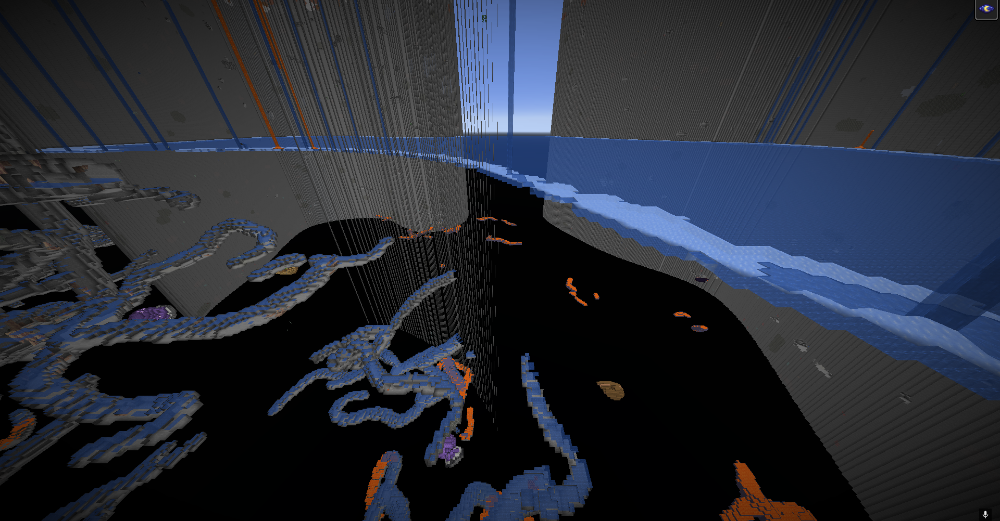

### Surface Rule
Поверхностные правила - это правила по которым некоторые блоки на поверхности мира заменяются. Изначально (как было видно на прошлых скриншотах), мир генерируется полностью из камня (ну или из блока укзаного в качестве `default_block`), а поверхностные правила проверяют некоторые условия для каждого блока и если блок им удовлетворяет, то они его заменяют.

Эти правила применяются при генерации всех биомов: в пустыне камень меняют на песок и песчаник, в болоте - на грязь и так далее.

Так же эти правила диктуют игре, на каком уровне заменять камень на бедрок и глубинный сланец.

### Растительность
Сверху мир выглядит отлично!  
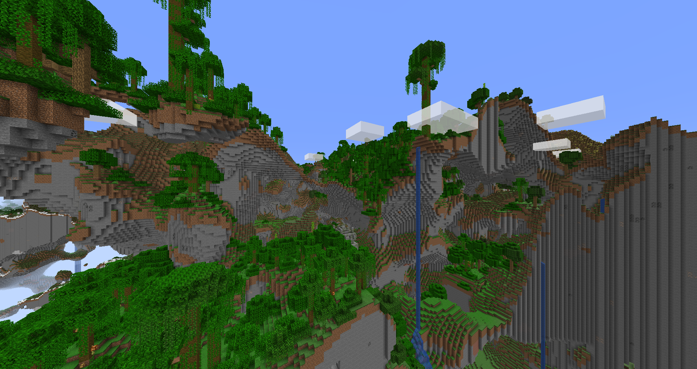  
А вот в остальных местах... Чего-то не хватает?  
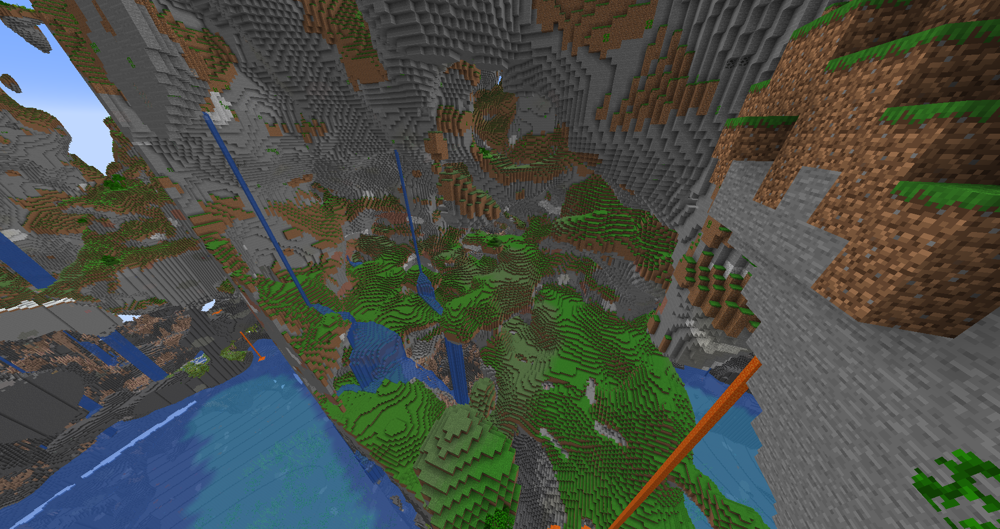

Почему-то Майнкрафт не хочет генерировать деревья да и вообще любую растительность нигде, кроме как на поверхности. Почему-то... На расследование этой проблемы у меня ушло 5 часов, но я все-такие нашел. Пропущу объяснения, как я дошел до этого момента, но в конце концов я столкнулся лицом к лицу с файлами в папке placed_feature. И вот оно!  
```
{
  "feature": "minecraft:trees_birch_and_oak",
  "placement": [
    {
      "type": "minecraft:count", (1)
      "count": {
        "type": "minecraft:weighted_list",
        "distribution": [
          {
            "data": 10,
            "weight": 9
          },
          {
            "data": 11,
            "weight": 1
          }
        ]
      }
    },
    {
      "type": "minecraft:in_square" (2)
    },
    {
      "type": "minecraft:surface_water_depth_filter", (3)
      "max_water_depth": 0
    },
    {
      "type": "minecraft:heightmap", (4)
      "heightmap": "OCEAN_FLOOR"
    },
    {
      "type": "minecraft:biome" 
    }
  ]
}
```
в папке placed_feature лежат файлы, в которых описаны алгоритмы генерации деревьев, цветочков, грибов, да и вообще много чего. И вот он момент, который все мне ломает:  
`"heightmap": "OCEAN_FLOOR"` - карта высот. Потратив еще несколько часов на то, чтобы разобраться как работает этот формат файла и что он вообще делает, я выяснил, что
0. Майнкрафт ставит точку на нижнем слое в верхнем левом углу чанка.
1. Count копирует точку некоторое количество раз
2. In square рандомизирует положение копий точки в рамках одного чанка
3. Surface water depth filter фильтрует и оставляет только точки, непогруженные под воду
4. Heightmap устанавливает координату y исходя из того, чему равна эта координата на карте высот. А совершенно очевидно, что двумерная карта высот передаст только 1 значение - наивысшую точку. Поэтому деревья и не ставятся нигде, кроме как на верхнем слое!

И вот чтобы решить эту проблему, я переписал [генерационные файлы](src/generated/resources/data/minecraft/worldgen/placed_feature) для каждого дерева, гриба, травинки, куста и цветочка. Теперь точки рандомизируются в рамках одного уровня (уровень - это блоки, разделенные водой, лавой или воздухом).

Получилось не сломать рабочую генерацию сверху мира:  
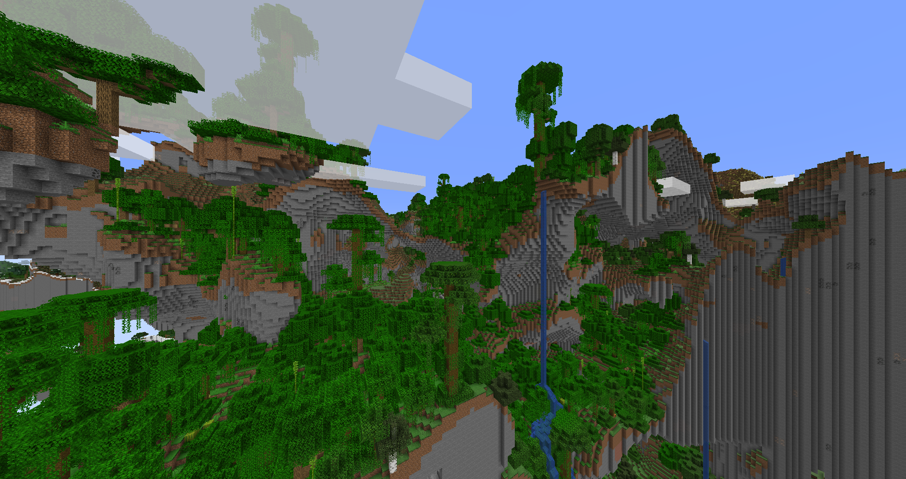  
и при этом починить под землей:  
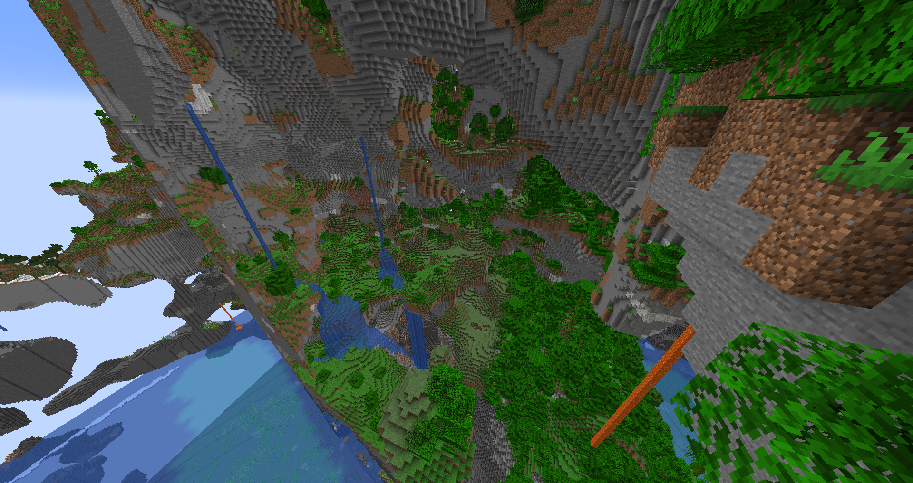

#### Бамбук и подзол
Бамбук должен заменять блоки травы, на которых он появляется на подзол. Опять же, на поверхности все работает отлично:  
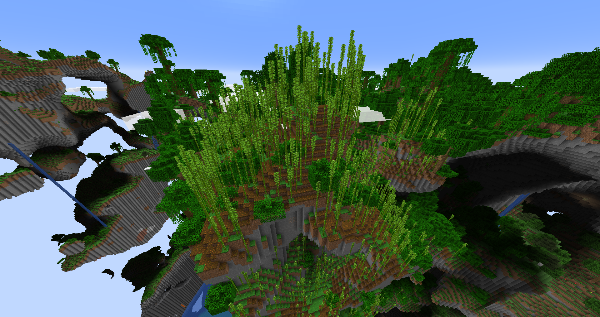  
а вот в пещерах опять ошибка - подзола нет:  
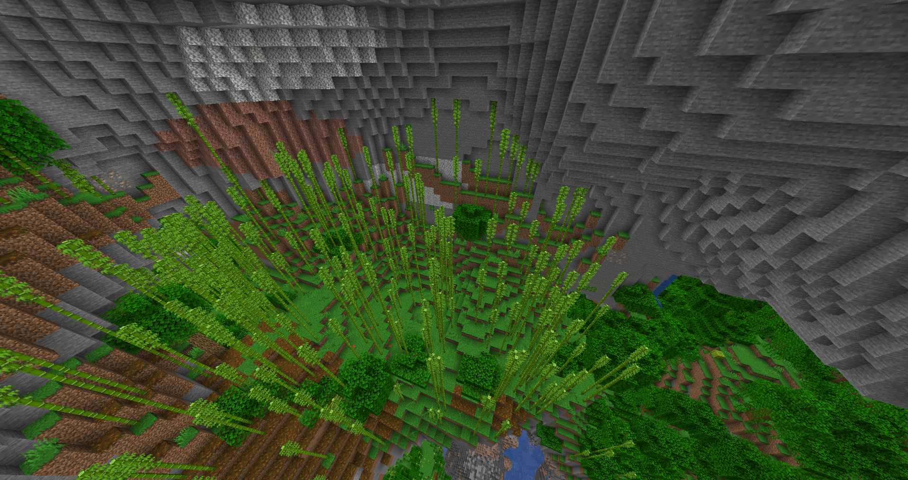

В этот раз причина обнаружилась раньше, опять же в исходном коде игры:
```
 blockpos$mutableblockpos1.set(l, worldgenlevel.getHeight(Heightmap.Types.WORLD_SURFACE, l, i1) - 1, i1);
                        if (isDirt(worldgenlevel.getBlockState(blockpos$mutableblockpos1))) {
                           worldgenlevel.setBlock(blockpos$mutableblockpos1, Blocks.PODZOL.defaultBlockState(), 2);
                        }
```
при устновке бамбука игра устанавливает блок под ним в подзол. Но высоту блока под бамбуком (коориднаты которого игра между прочим знает!) по какой-то причине она берет из карты высот - что опять же, в целом глупо, а в моем случае просто неприемлимо! [Миксин](src/main/java/mixin/BambooFeatureMixin.java) меня опять спас.

Не сломал старое:  
  
Починил новое:  
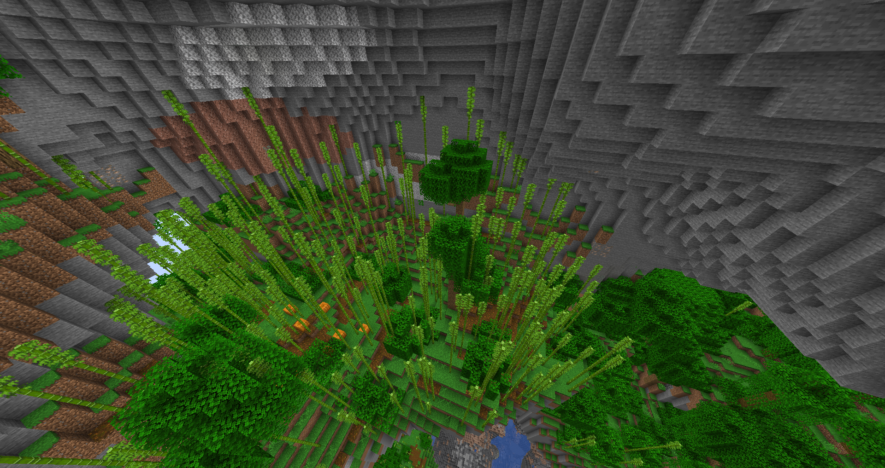  
#### Какао бобы и пчелы
В обычном мире деревья ставятся на поверхность (то есть на самую высокую точку на данных (x, z) координатах). Деревья выше 256 блоков натурально не генерируются вообще. Эти два факта ведут к тому, что если дерево выбрало точку для появления - ему ничего не помешает появится. В моем же случае дерево может попытаться появится в следующих местах:  
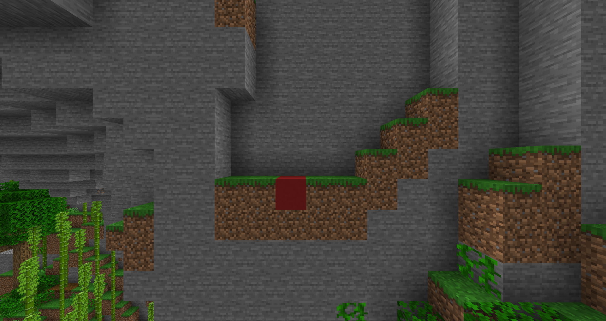  
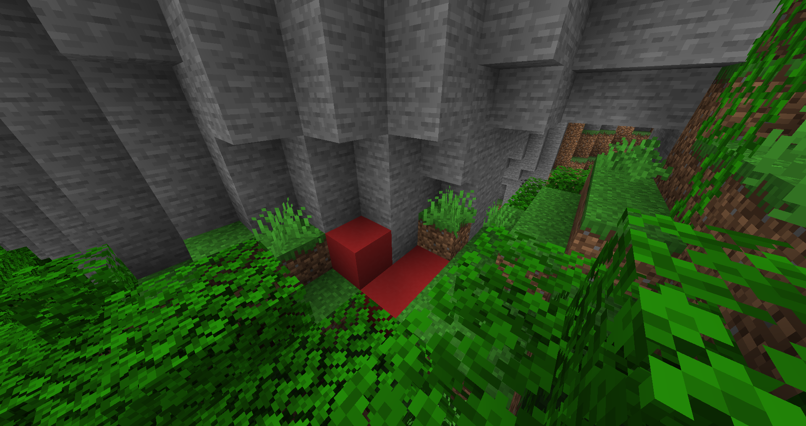  
Места, где дерево не появится, потому что ему места маловато...  
А декораторы деревьев (они отвечают за то, чтобы повесить, например, какое бобы или пчелиные гнезда на деревья) об этом факте не знают - они думают, что дерево всегда появится на выбранных координатах, как в обычном мире. Со спокойной душой они делают что-то вроде:  
```
List<BlockPos> list = pContext.logs();
         int i = list.get(0).getY();
```
и получают ошибку Java, потому что пытаются взять первый элемент пустого списка (список пустой потому что дерева нет и бревен соответственно тоже), преводящую к крашу игру. Решил вопрос с помощью миксинов [[1]](src/main/java/fogy/mixin/BeehiveDecoratorMixin.java) и [[2]](src/main/java/fogy/mixin/CocoaDecoratorMixin.java)!
